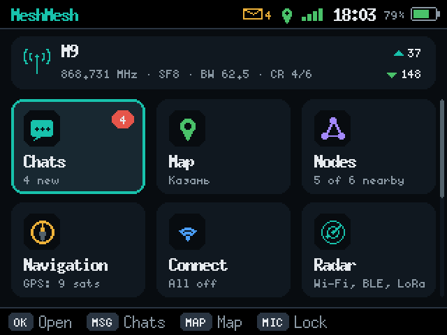
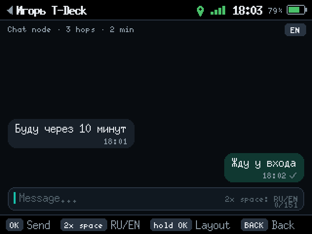
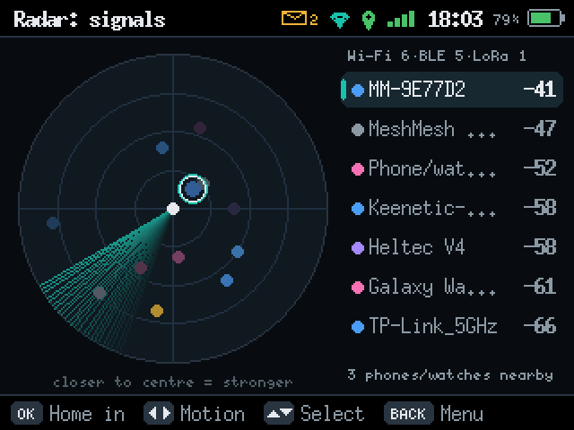

# MeshMesh

[English](README.md) · [Русский](README.ru.md) · [Українська](README.uk.md) · [Español](README.es.md) · [Português](README.pt.md) · [Français](README.fr.md) · **Deutsch** · [Italiano](README.it.md) · [Polski](README.pl.md) · [Türkçe](README.tr.md) · [中文](README.zh.md) · [日本語](README.ja.md) · [한국어](README.ko.md) · [العربية](README.ar.md) · [Bahasa Indonesia](README.id.md)

**Website und Installation mit einem Klick im Browser: https://ikrasnodymov.github.io/meshmesh/**

Firmware für netzunabhängige Kommunikation auf LoRa-Geräten mit ESP32 und nRF52. Nachrichten springen per Funk
von Gerät zu Gerät, ohne Internet, ohne Mobilfunk und ohne Server. Die Funkschicht ist
[MeshCore](https://github.com/meshcore-dev/MeshCore), daher kommunizieren MeshMesh-Knoten mit gewöhnlichen
MeshCore-Knoten.

<p>



</p>

## Funktionen

- **Chats** — direkte und öffentliche Nachrichten, ✓✓-Zustellbestätigungen, Wiederholungen, Route bei jeder Nachricht.
- **Kanäle** — bis zu 8 MeshCore-Kanäle: Beitritt per #Hashtag, `meshcore://`-Link oder QR-Code, Name und Schlüssel;
  einen privaten Kanal erstellen, Kontakte per Direktnachricht einladen, auf Sendung gehörte Kanäle finden. [docs/en/channels.md](docs/en/channels.md)
- **Offline-Karten** — OpenStreetMap-Kacheln auf der SD-Karte, GPS-Position und Knoten auf der Karte.
- **Knoten in der Nähe** — Signal, Hops, Entfernung und Richtung; Kontakte, Repeater und Räume.
- **Signalradar** — Wi-Fi, Bluetooth und LoRa in der Umgebung, mit Peilung nach „wärmer / kälter“.
- **Bewegungssensor** — zwei Boards erkennen eine Person, die zwischen ihnen hindurchgeht (Wi-Fi CSI).
- **Schach** mit Ihren Kontakten über das Mesh und Klondike-Solitär auf dem M9.
- **Mesh-Haustier** — ein pixeliges Wesen im Tamagotchi-Stil auf jeder Platine: Es ernährt sich vom Funkverkehr, wächst und kann an Hunger oder Einsamkeit sterben. [docs/en/pet.md](docs/en/pet.md)
- **Schach ohne MeshMesh auf dem Gerät**: [Die Schachseite](https://ikrasnodymov.github.io/meshmesh/chess/) spielt über ein
  Board mit der offiziellen MeshCore-Companion-Firmware, per USB (Web Serial) oder Bluetooth (Web Bluetooth), in Chrome oder Edge.
- **Repeater- und Raumserver-Modus** — gewählt beim Start (Bildschirm des M9, Taste des Heltec) oder in den Einstellungen,
  auf der Webseite, über USB: Das Gerät wird zu einem mit der Original-Firmware kompatiblen MeshCore-Repeater oder Raumserver
  mit Admin-Anmeldung und Fern-CLI aus der MeshCore-App; Schlüssel, Kontakte und Verlauf bleiben erhalten.
  [docs/en/repeater.md](docs/en/repeater.md)
- **GPS und Kompass**, Teilen der Position, Sperrbildschirm, phonetische kyrillische Tastatureingabe.
- **Weboberfläche** über den eigenen Wi-Fi-Access-Point des Geräts oder das Heim-WLAN, mit dem es verbunden ist (M9, T-Deck), und eine **Android-App**
  (Wi-Fi, Bluetooth LE oder USB) mit Benachrichtigungen bei Nachrichten.
- **Geräteoberfläche in 15 Sprachen**: Englisch, Russisch, Ukrainisch, Spanisch, Portugiesisch, Französisch, Deutsch, Italienisch,
  Polnisch, Türkisch, Chinesisch, Japanisch, Koreanisch, Arabisch und Indonesisch. Die Website installiert die Firmware in
  der gewählten Sprache; in den Einstellungen lässt sie sich später ändern.

## Boards

| Board | Status |
|---|---|
| Elecrow ThinkNode M9 (Tastatur, 320×240-Bildschirm) | auf Hardware getestet |
| Heltec WiFi LoRa 32 V4 (OLED, eine Taste) | auf Hardware getestet |
| GAT562 30S Mesh Kit (nRF52840, OLED, Joystick; kein Wi-Fi) | auf Hardware getestet (in unserem Exemplar ist kein GPS-Modul bestückt) — [docs/en/gat562.md](docs/en/gat562.md) |
| Heltec Mesh Node T114 (nRF52840, Farb-TFT 240×135, eine Taste; kein Wi-Fi) | auf Hardware getestet — [docs/en/t114.md](docs/en/t114.md) |
| Heltec V4-R8, Heltec V3, Heltec Wireless Tracker, LilyGO T-Deck, T-Beam, T-Beam Supreme, T3-S3, T-LoRa V2.1-1.6, Seeed XIAO ESP32S3 + Wio-SX1262, B&Q Station G2, Elecrow ThinkNode M2 | nur gebaut, noch nicht auf Hardware ausgeführt — Berichte willkommen |

ESP32-Boards haben alle Funktionen. Das GAT562 (nRF52840) hat kein Wi-Fi: keinen Access Point, kein Wi-Fi-Radar,
keinen Bewegungssensor und keinen Internet-Client; das Telefon verbindet sich über die Android-App per Bluetooth oder USB.
Dafür gibt es eine Bildschirmtastatur und Schach auf dem OLED. Pins und Details: [docs/en/boards.md](docs/en/boards.md).

## Installation

**Browser:** Öffnen Sie die [Website](https://ikrasnodymov.github.io/meshmesh/#install) in Chrome oder
Edge auf einem Computer, wählen Sie Ihr Board und die Gerätesprache und klicken Sie auf **Installieren**. Ein MeshMesh-Update
behält Schlüssel, Kontakte, Einstellungen und Verlauf; „Erase device“ nur beim Umstieg von einer anderen Firmware ankreuzen.

**esptool:** Laden Sie das ZIP-Archiv des Boards von der Website herunter und führen Sie aus:

```sh
python -m esptool --chip esp32s3 --port PORT write-flash --flash-mode dio --flash-freq 80m --flash-size 16MB \
  0x0 bootloader.bin 0x8000 partitions.bin 0xe000 boot_app0.bin 0x10000 firmware.bin
```

(ESP32-Boards: `--chip esp32`, Bootloader bei `0x1000`, `--flash-freq 40m`; Flash-Größe je nach Board.)

**GAT562 (nRF52840):** derselbe Button **Installieren** auf der Website (serielles DFU über Web Serial); ein Board
mit anderer Firmware braucht zuerst zweimal RESET. Oder zweimal RESET drücken — ein Laufwerk `GAT562-BOOT`
erscheint — und `firmware.uf2` von der Website darauf kopieren. Spätere Updates: `python tools/nrf52.py flash PACKAGE` ([docs/en/gat562.md](docs/en/gat562.md)).

Standard-Funkprofil: 868.731 MHz, BW 62.5 kHz, SF8, CR4/6 — änderbar unter Einstellungen → Funk; alle Knoten
eines Netzes müssen übereinstimmen. Beachten Sie die Funkvorschriften Ihres Landes.

## Bauen

```sh
python3 -m venv .venv
.venv/bin/pip install platformio esptool pyserial cryptography
.venv/bin/pio run -e m9            # or heltec_v4, tdeck, tbeam, ...
.venv/bin/python tools/package.py m9
```

Android-App: `cd android && ./gradlew testDebugUnitTest assembleRelease` ([docs/en/android.md](docs/en/android.md)).
Die Bildschirmoberfläche lässt sich ohne Board auf einem Computer rendern: `tools/ui_preview/build.sh m9 OUTDIR en`.

## Dokumentation

Ausführliche Dokumentation auf Englisch: [Kanäle](docs/en/channels.md), [MeshCore-Kompatibilität](docs/en/meshcore-migration.md), [Boards](docs/en/boards.md),
[GAT562](docs/en/gat562.md), [Android](docs/en/android.md), [Repeater- und Raummodus](docs/en/repeater.md),
[Schachprotokoll](docs/en/chess.md), [Kartenformat](docs/en/maps-format.md), [Vergleich mit MeshCore](docs/en/feature-parity.md),
[Prüfung auf Hardware](docs/en/verification.md). Die russischen Originale liegen in [docs/](docs/), die vollständige
Anleitung zu Bedienung und Funktionen in [README.ru.md](README.ru.md).

Noch nicht geprüft: LoRa-Reichweite, GPS-Genauigkeit unter freiem Himmel, Kompassgenauigkeit, Weiterleitung über einen
dritten Repeater. Nicht implementiert: Sprachübertragung, Routenplanung, OTA-Updates.

## Lizenz

[MIT](LICENSE). Das mitgelieferte MeshCore (`lib/MeshCore`) behält seine eigene MIT-Lizenz. Kartendaten ©
[OpenStreetMap](https://www.openstreetmap.org/copyright)-Mitwirkende. Die Radar-Idee folgt
dem RSSI-Tracker und den Radar-HUDs von [Stevee87](https://github.com/Stevee87).
