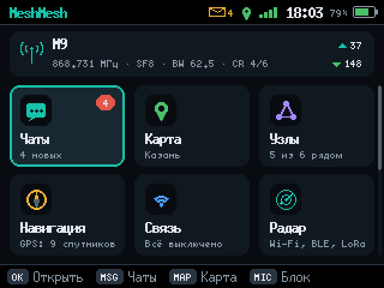
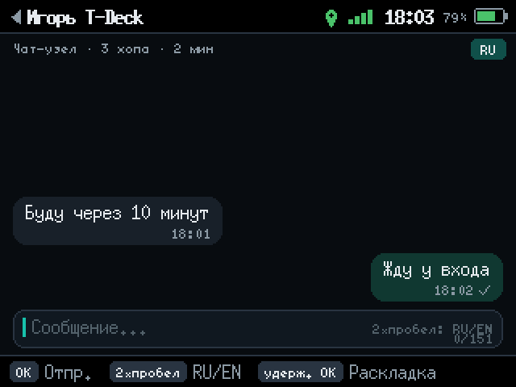
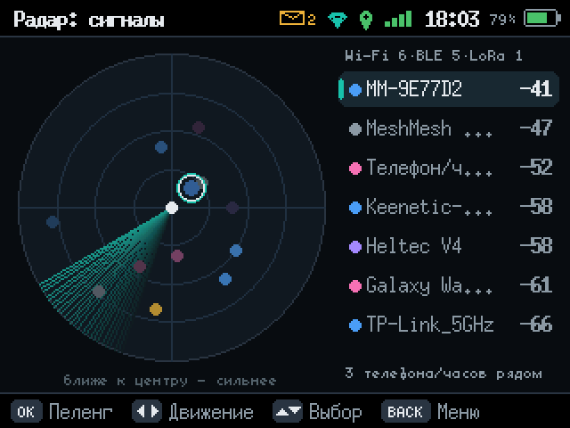

# MeshMesh

[English](README.md) · **Русский** · [Українська](README.uk.md) · [Español](README.es.md) · [Português](README.pt.md) · [Français](README.fr.md) · [Deutsch](README.de.md) · [Italiano](README.it.md) · [Polski](README.pl.md) · [Türkçe](README.tr.md) · [中文](README.zh.md) · [日本語](README.ja.md) · [한국어](README.ko.md) · [العربية](README.ar.md) · [Bahasa Indonesia](README.id.md)

**Сайт и установка из браузера: https://ikrasnodymov.github.io/meshmesh/**

Прошивка для LoRa-устройств на ESP32 и nRF52 (Elecrow ThinkNode M9, Heltec V4, Heltec T114, GAT562 30S и ещё 11 плат):
чаты без интернета и сотовой сети, офлайн-карты, радар сигналов, датчик движения по Wi-Fi CSI,
шахматы по радио, веб-интерфейс и приложение для Android. Радио совместимо с MeshCore.

*Off-grid LoRa messaging firmware for ESP32 devices, MeshCore-compatible radio, offline maps,
signal radar and a web/Android interface. Install it from the browser on the site above.*

<p>



</p>

Лицензия — [MIT](LICENSE). MeshCore в `lib/MeshCore` — под своей лицензией MIT.

## 0.7.0 — кости и модули nRF52

Дайсер DIC3R на всех платах, веб-странице и в приложении: пул костей RPG и формулы (`2d6+1`, `4к6-2`, d66, d%),
сетка Warhammer с порогом успеха, счётчики и персонажи ([docs/dice.md](docs/dice.md)). На T114 и GAT562 шахматы,
питомец и кости — отключаемые модули: свой набор собирается `tools/nrf52.py package ENV --without …`
([docs/gat562.md](docs/gat562.md#модули-выбор-перед-установкой)); сайт и приложение ставят полный набор.
Кости проверены владельцем на M9; образы с модулями на плате пока не проверялись.

## 0.6.0 — ответ свайпом

В чатах приложения и веб-страницы ответ на сообщение — свайп справа налево, как в Telegram (на компьютере —
двойной щелчок). В канале ответ начинается с упоминания `@[Имя]`, в личке — с короткой цитаты `> …`; страница
показывает цитату блоком. Проверено в Chrome эмулятора Android на тестовых данных, не с платой.

## 0.5.1 — режим flash Heltec V3

На Heltec V3 пользователя (flash GigaDevice `c84017`) запись не сохранялась нигде выше `0x310000`, перенос
0.4.3 не помог, а другие прошивки на той же плате пишут. Наши сборки записывали в заголовок образа DIO, а
драйвер flash брали из библиотек под QIO; для V3 драйвер теперь тоже DIO. `flashstatus` называет драйвер и его
режим, `flashprobe` дополнительно пишет функциями ПЗУ, как esptool. Исправление на V3 ещё не проверено.

## 0.4.3 — хранилище на flash, которая не держит запись

Если раздел LittleFS не сохраняет запись (так у пользователя Heltec V3), `fsformat` и пункт «Создать
хранилище…» размещают хранилище в свободном слоте OTA и запоминают это место в NVS; ключ и настройки
не затрагиваются. USB-команды `flashstatus` (ID и размер микросхемы, регистры SR1–SR3, место хранилища)
и `flashprobe` (пробная запись по адресам) помогают найти причину ([docs/boards.md](docs/boards.md)).

## 0.4.2 — время сообщений

Сообщение, принятое или отправленное до установки часов, получает точное время, как только часы
установлены (с телефона, по NTP или GPS). Подменённый GPS-сигнал больше не ставит ложную дату:
время раньше даты сборки прошивки отклоняется, а время с телефона или NTP GPS не перезаписывает.
Android 0.4.1: уведомления о сообщениях не повторяются после того, как плата досчитала их время.

## 0.4.1 — выгрузка истории

Убран дополнительный JSON-пул на 32 КБ при выгрузке сообщений: записи сериализуются по одной,
память под ответ проверяется заранее. Ошибка памяти больше не маскируется пустой историей.
Версия Android остаётся 0.4.0, номер каждой опубликованной сборки приложения увеличивается.

## 0.4.0 — ожидание событий на всех платах и версии выпусков

- Все платы ожидают LoRa-события при погашенном экране во всех ролях, включая обычный чат;
  [условия и пределы проверки](docs/power.md). Ток и прирост автономности пока не измерены.
- Прошивка и Android получили независимые версии, общую привязку к Git и проверяемые пакеты.
  Каждый пуш `main` собирает и публикует все платы, APK и сайт; [порядок выпуска](docs/releases.md).

## 0.3.9 — энергосбережение и исправления

- На платах ESP32 процессор работает на 80 МГц, пока экран погашен и выключены Wi-Fi и радар; в режимах
  репитера и комнаты плата спит между пакетами и просыпается от пакета LoRa, кнопки или USB
  ([docs/repeater.md](docs/repeater.md#энергосбережение)).
- Радио, не принявшее ни одного пакета за 10 минут, настраивается заново, как при загрузке (защита от
  «оглохшего» приёмника); в режимах сервера это делает и `agc.reset.interval`.
- Bluetooth включён по умолчанию (в режимах репитера и комнаты — выключен), PIN создаётся один раз,
  выбор сохраняется после перезапуска.
- На OLED-платах батарея в режиме «Проценты» показывается числом, а не значком.
- `fsformat` проверяет стирание и запись flash, при защищённой от записи области снимает защиту и называет
  шаг, на котором произошла ошибка; `flashstatus` показывает регистр статуса flash.

## 0.3.8 — каналы MeshCore

До 8 каналов вместе с Public: вступить по #хештегу, ссылке `meshcore://channel/add?...` или QR-коду,
по названию и ключу (32 hex или base64), создать закрытый канал со случайным ключом и пригласить в него
контакт личным сообщением; каналы, услышанные в эфире, проверяются распространёнными хештегами.
На M9 и T-Deck — «Чаты → Добавить канал» и карточка канала с QR-кодом (←/→ на строке канала, ← в чате);
на Heltec и GAT562 сообщения подписаны каналом, вступить можно по приглашению или в услышанный канал из
меню, остальное — через веб-страницу и приложение (там же сканирование QR камерой и ссылки
`meshcore://` из других приложений). Ключи и ссылки совместимы с приложением MeshCore и WadaMesh.
Подробности — [docs/channels.md](docs/channels.md).

Контакты и отметки прочтения теперь хранятся в LittleFS (`/meshmesh/contacts.bin`, `/meshmesh/read.bin`),
а не в NVS: на M9 раздел NVS (20 КБ) заполнился, и список контактов перестал сохраняться. При первом
запуске 0.3.8 старый список переносится сам; `status` показывает запас NVS (`nvs_free`).

## 0.3.7 — 15 языков

Экраны всех плат переведены на 15 языков: английский, русский, украинский, испанский, португальский,
французский, немецкий, итальянский, польский, турецкий, китайский, японский, корейский, арабский и
индонезийский («Настройки → Экран и устройство → Язык», на Heltec и GAT562 — пункт «Язык» в меню
настроек, по USB — `set {"lang":"de"}`). Сайт тоже на 15 языках; перед установкой он спрашивает язык
устройства и записывает его вместе с прошивкой: язык применяется при первом запуске после такой
установки, обновление через `tools/flash.py` его не меняет. Китайский, японский, корейский и арабский
выводятся встроенными подмножествами пиксельных шрифтов; арабский рисуется справа налево внутри обычной
раскладки экрана. Раскладки клавиатуры M9 по-прежнему RU и EN. Веб-страница устройства и приложение —
по-русски. Как добавить или поправить перевод — [i18n/README.md](i18n/README.md).

## Heltec T114 — цветной экран

Вторая плата на nRF52840: Heltec Mesh Node T114 с TFT 240×135. Однокнопочный интерфейс Heltec
рисуется в родном разрешении экрана и в цвете, шахматы одной кнопкой — на цветной доске; GPS, радар
BLE и LoRa, режимы репитера и комнаты. Установка — как у GAT562 (кнопка «Установить» на сайте или
диск `HT-n5262` после двойного RESET). Подробности — [docs/t114.md](docs/t114.md).

## Установка GAT562 из браузера

Кнопка «Установить» на сайте работает и для GAT562: страница говорит с загрузчиком nRF52 по
Web Serial (`site/nrf52dfu.js`, протокол `adafruit-nrfutil`). Подробности — [docs/gat562.md](docs/gat562.md).

## 0.3.6 — GPS у GAT562

На нашей GAT562 модуль GPS не установлен (проверено по схеме производителя, измерениями и
осмотром платы). Прошивка подаёт питание на GPS только при включённом GPS в настройках; для
проверки железа по USB добавлены `gpio N pu|pd` и `i2cscan`. Остальные платы отличаются
от 0.3.5 только строкой версии.

## 0.3.5 — исправление для GAT562

GAT562 с выключенным в настройках GPS зависал на заставке при каждом запуске; исправлено.
Остальные платы отличаются от 0.3.4 только строкой версии.

## 0.3.4 — GAT562 30S (nRF52840)

Первая плата не на ESP32: GAT562 30S Mesh Kit — nRF52840, SX1262 с усилителем, OLED 128×64,
джойстик и кнопка «назад», зуммер. Чаты MeshCore, узлы, режимы репитера и комнаты, радар BLE и
LoRa, Bluetooth для приложения Android и USB. Только на ней — экранная клавиатура (EN/RU/символы)
и шахматы с контактами на OLED. Wi-Fi в nRF52840 нет: нет точки доступа и веб-страницы по Wi-Fi,
Wi-Fi-радара, датчика CSI и интернет-клиента; карт нет (нет SD). Установка — файл UF2 на диск
загрузчика, обновления — `tools/nrf52.py flash`. Подробности, раскладка flash, проверки и
неясности (GPS на нашем экземпляре молчит) — [docs/gat562.md](docs/gat562.md).

Для остальных плат 0.3.4 отличается от 0.3.3 USB-командой `restart` и веб-страницей,
которая учитывает платы без Wi-Fi; на M9 и Heltec V4 0.3.4 пока не устанавливалась.

## 0.3.3 — репитер и комната

Устройство может работать в одном из трёх режимов: обычном, репитера MeshCore или комнаты MeshCore
(room server). Режим выбирается в первые 5 секунд после загрузки (экран M9 и T-Deck, кнопка
однокнопочных плат), в настройках, на веб-странице или по USB. Вход администратора и CLI доступны
из приложения MeshCore; ключ узла и данные общие для всех режимов. Проверено со стороны официальной
MeshCore companion v1.17.1 — [docs/repeater.md](docs/repeater.md).
Пакеты: `artifacts/meshmesh-<плата>-0.3.3`.

## 0.3.2 — MeshCore

Радио переведено на MeshCore; наш интерфейс, карты и настройки сохранены.
Порядок обнаружения, параметры, ключи и ограничения — в [руководстве перехода](docs/meshcore-migration.md).
Пакеты 0.3.2: `artifacts/meshmesh-m9-0.3.2`, `artifacts/meshmesh-heltec-v4-0.3.2`.
Аппаратные результаты и ограничения: [отчёт проверки](docs/verification.md).
Что есть и чего нет по сравнению с MeshCore и WadaMesh: [сравнение](docs/feature-parity.md).
Сборки для десяти плат сообщества (Heltec V3 и Wireless Tracker, LilyGO T-Deck,
T-Beam, T-Beam Supreme, T3-S3 и T-LoRa, XIAO ESP32S3 + Wio-SX1262, Station G2,
ThinkNode M2) — [docs/boards.md](docs/boards.md); на этих платах прошивка ещё не запускалась.

В 0.3.2 добавлен радар сигналов — по идее RSSI-трекера и радарных HUD
[Stevee87](https://github.com/Stevee87) (без датчика RD-03D и LiDAR: их на платах нет).
Раздел «Радар» (M9 — плитка главного меню, Heltec — экран после «Узлов»)
показывает развёртку с точками трёх видов: Wi-Fi-точки доступа (синие; открытые —
жёлтые), Bluetooth-устройства (розовые — телефоны, часы и наушники, серые — прочие)
и LoRa-узлы, услышанные напрямую (фиолетовые). Чем ближе к центру, тем сильнее
сигнал; угол условный и только разводит точки — RSSI не даёт ни направления, ни
расстояния. Справа — список по силе сигнала и счётчик «телефонов/часов рядом».
Тип Bluetooth-устройства берётся из объявляемого Appearance или формата
производителя (Apple, Samsung, Google, Huawei, Xiaomi, Garmin); это устройства,
а не люди: адреса телефонов периодически меняются, поэтому счёт приблизительный.
Имена сетей и адреса устройств видны только на экране, в USB-диагностику не выводятся.

OK (Heltec: удержание PRG → «Пеленг») включает пеленг на выбранную цель: крупный
сглаженный RSSI, шкала с пиком и отставанием от него, история отсчётов и индикатор
«теплее / холоднее / ровно». Как в `rf_target_tracker.py` у Stevee87: медиана пяти
окон по 100 мс, быстрое и медленное среднее, вход в состояние при 2,5 дБ, выход ниже
1,5 дБ, новое состояние принимается через 1,2 с. Для Wi-Fi приёмник слушает канал цели
и считает только маяки (beacon/probe response) с её BSSID; для Bluetooth — объявления
устройства; для LoRa — каждый прямой пакет узла (объявления редки — раз в минуты).
Без отсчётов 1,5 с цель «потеряна». Звук пеленга на M9 учащается (1,2 с → 60 мс) и
повышается с ростом сигнала от −85 до −30 dBm, при потере — тихий тик раз в 2 с
(OK — выкл/вкл, учитывает общий «Звук»); на Heltec мигает светодиод; ←/→ сбрасывает
пик. Во время пеленга экран не гаснет и не блокируется.

Радар пользуется Wi-Fi только пока открыт и только при выключенной точке доступа:
её включение забирает Wi-Fi у радара. Bluetooth сканирует поверх сервиса MeshMesh BLE
или, если он выключен, поднимает стек сам и освобождает его при выходе. При пеленге
на Wi-Fi сканирование Bluetooth приостанавливается, при пеленге на Bluetooth —
развёртка Wi-Fi. Сканирование Wi-Fi запускается напрямую через ESP-IDF: в Arduino
2.0.17 `scanNetworks()` не обнуляет `home_chan_dwell_time`, и на M9 драйвер отклонял
сканирование. На главном экране M9 плитки прежнего размера, три в ряд: «Радар» — в
конце второго ряда; третий ряд («Модули» — состояние модулей, «Настройки», «Косынка»)
открывается прокруткой вниз, в четвёртом ряду — «Шахматы»; справа полоса прокрутки. USB-команда `radar` выдаёт
счётчики, уровни и состояние сканирования.

**Движение (Wi-Fi CSI).** Две платы образуют датчик движения: одна — маяк (ESP-NOW,
50 кадров/с, OFDM 6 Мбит/с, канал 1), другая — приёмник. Приёмник берёт CSI (амплитуды
52 поднесущих) каждого кадра маяка, усредняет по 100 мс и считает «дрожание» канала —
1 − корреляция соседних векторов, среднее за 0,5 с. Человек, идущий между платами или
рядом, заметно раскачивает канал: при −40 dBm на столе фон 0,005–0,011, ходьба
0,013–0,039. Калибровка — 10 с без движения в зоне; порог — фон × 2,2 (не менее
фон + 0,004), до калибровки 0,015; «ДВИЖЕНИЕ» держится 2 с после последнего окна выше
порога. M9: «Радар» → ←/→ (подсказка внизу) — вкладка «Радар: движение (CSI)» с состоянием, шкалой, порогом
и историей за минуту; OK — калибровка, B — роль (приёмник/маяк); при начале движения
звучит сигнал. Heltec: на экране «Радар» удержание PRG — первые пункты меню «Маяк CSI» и «Приёмник CSI»;
светодиод горит при движении. Это обнаружение движения в зоне между платами, а не
положение людей: неподвижный человек почти не виден, сердцебиение так не снять.
Приёмнику нужен свободный Wi-Fi (точка доступа выключена); маяк работает и при
включённой точке доступа. Развёртка Wi-Fi и сканирование Bluetooth на время CSI стоят.

Для исследований по USB: `csirate N` — частота маяка (10–200 кадров/с, по умолчанию 50),
`csistream on|off` — поток сырых IQ 52 поднесущих с приёмника строками `CSI мкс rssi hex`
(удобно с native USB Heltec). Опыт «пульс и дыхание по отражению» (платы рядом, человек
в 70 см) частот не выявил — см. `docs/verification.md`.

Bluetooth-контроллер с 0.3.2 поднимается один раз за загрузку и больше не
деинициализируется: «BLE выкл.» — нет рекламы, соединения разорваны, команды не
принимаются. Причина: после деинициализации и повторного запуска контроллера данные
CSI до перезагрузки переставали меняться (ESP32-S3, IDF 4.4), а деинициализация сразу
после остановки сканирования роняла M9 (паника в задаче NimBLE; была в первой сборке
радара при закрытии радара с выключенным BLE). Цена — около 65 КБ внутренней памяти
после первого включения Bluetooth. При выключении Wi-Fi с живым контроллером драйвер
пишет в USB-журнал `wifi:timeout when WiFi un-init, type=4`; сбоев за этим не
наблюдалось.

**Шахматы с контактами (M9).** Плитка «Шахматы»: вызов чат-контакта (белые,
чёрные или случайно), партия на доске 8×8 с курсором, подсказкой допустимых ходов,
превращением пешки, предложением ничьей, сдачей, реваншем и повтором недоставленного
хода. Ходы идут обычными личными сообщениями MeshCore с ACK (`♟3F2A 5 g1f3 3. Nf3`),
поэтому проходят через ретрансляторы и читаются в штатном приложении MeshCore; общий
канал не используется. Правила — полностью (рокировка, взятие на проходе, мат, пат,
повторение, 50 ходов, недостаточно материала), до 6 партий сохраняются в LittleFS и
переживают перезапуск. На M9 играют на экране или на веб-странице, на Heltec — на
веб-странице его точки доступа (на OLED приходит уведомление о ходе). Протокол и проверки — [docs/chess.md](docs/chess.md).

Со штатной прошивкой MeshCore Companion тоже можно играть: [страница шахмат на сайте](https://ikrasnodymov.github.io/meshmesh/chess/)
подключается к такой плате по USB (Web Serial) или Bluetooth (Web Bluetooth) в Chrome или Edge и ходит
обычными личными сообщениями MeshCore; правила и партии работают в браузере.

**Питомец сети (все платы).** Пиксельный зверёк вроде тамагочи: вылупляется из яйца, питается эфиром
(принятые и пересланные пакеты, сообщения, подтверждения доставки, новые узлы, победы в шахматах),
растёт от малыша до взрослого, говорит репликами в «облачке» и может умереть от голода или одиночества,
оставив надгробие; смерть можно выключить. На M9 и T-Deck — плитка «Питомец» (OK — погладить, F —
покормить, H — лечить, N — имя, D — смерть вкл/выкл), на OLED и T114 — экран после «Шахмат» с меню по
удержанию кнопки. Живёт и в режимах репитера и комнаты. Подробности — [docs/pet.md](docs/pet.md).

**Кости (все платы).** Дайсер DIC3R: пул костей RPG и любые формулы (`2d6+1`, `d20+5`, `4к6-2`, d66, d%)
с костями, нарисованными своими фигурами, сетка Warhammer до 50 костей с порогом успеха, счётчики жизней
и ресурсов, персонажи со своими сохранёнными бросками. Всё хранится на устройстве: экран, веб-страница и
приложение показывают одни и те же броски. На M9 и T-Deck — плитка «Кости» (OK — бросок, M — режим,
S — сохранённые броски, P — персонаж), на OLED и T114 — экран после «Питомца», бросок первым в меню по
удержанию. Подробности — [docs/dice.md](docs/dice.md).

**Косынка (M9).** Пасьянс «Косынка» (Klondike) — последняя плитка главного меню.
Сдача по одной или по три карты (D; для начатой партии — со следующей), очки как в
Windows (+10 в дом, +5 из сброса на стол и за открытую карту, −15 из дома на стол,
−100/−20 за переворот колоды). Управление: ←/→ — стопка, ↑/↓ в столбце — сколько
карт взять (выше верхней — в верхний ряд), OK — взять/положить, на колоде — сдать;
пробел или удержание OK — переложить в подходящее место (сначала дом, затем ближайший
столбец); DEL или U — отмена (64 хода), P — подсказка, A — собрать в дома, N — новая
партия (начатую — повторным N), H — справка, BACK — вернуть взятые карты или выйти.
Когда колода и сброс пусты, а все карты открыты, игра собирает их сама; после
победы — каскад карт. Партия (76 байт, при загрузке проверяются все 52 карты и
правила раскладки) и статистика хранятся в NVS `meshmesh-game`: запись не чаще раза
в 20 с игры и при выходе. Время идёт только на экране игры при бодрствующем экране.
Длинные столбцы сжимаются, и у перекрытых карт индекс становится меньше. Радио
продолжает работать. Heltec игры не содержит (`Solitaire.cpp` исключён из сборки).

**Приложение для Android.** `android/` — приложение с веб-интерфейсом устройства в том же
оформлении (страница берётся из `web/index.html` при сборке) и подключением к M9 и Heltec
по Wi-Fi (точка доступа устройства, приложение подключается к ней само), Bluetooth LE
(сопряжение по PIN с экрана) и USB через OTG. Все разделы страницы работают по любому
каналу, включая карту с SD и радар; в фоне соединение держит служба, новые сообщения и ходы
в шахматах приходят уведомлениями. Для USB и BLE в прошивку добавлены команды `radar web`,
`radar do`, `map tile`, `sendjson`, а `connections` доступна и по BLE; ответы BLE идут
уведомлениями размера MTU. Сборка, устройство и проверка — [docs/android.md](docs/android.md).

В 0.3.1 переработан экранный интерфейс. M9: строка состояния (непрочитанные,
GPS, Wi-Fi/BLE, сигнал по SNR последнего пакета, часы, батарея), главная сетка
из восьми разделов (с 0.3.2), подсказки клавиш внизу, аватары и значки непрочитанного,
отметки доставки ✓ / ✓✓ / ошибка, карточка узла с расстоянием, сбросом пути и
удалением контакта, карта с компасом и масштабной линейкой, экран блокировки
с датой и сводкой сообщений. Символы, которых нет в кириллических шрифтах
(«·», «°», «№», эмодзи), больше не пропадают: берутся из Latin-1 или
показываются заменой.

Heltec V4 (OLED 128×64, одна кнопка PRG): клик — следующий экран, удержание —
действие экрана; если действий несколько, удержание открывает меню (клик —
следующий пункт, удержание — выполнить, последний пункт — «Закрыть меню»,
через 10 с меню закрывается само). Экраны: главный (часы, радио, RX/TX,
батарея), сообщения (история, ответы «OK» / «Принято», в том числе в Public),
узлы (сигнал, путь, давность, расстояние при GPS; «OK», сброс пути), радар
(с 0.3.2: сигналы Wi-Fi/LoRa, пеленг со светодиодом), GPS
(состояние, спутники, NMEA, координаты; вкл/выкл, передать позицию), Wi-Fi,
Bluetooth, настройки (язык, батарея %/В, гашение экрана, контраст), модули.
Строка состояния: непрочитанные, GPS, Wi-Fi/BLE, сигнал, батарея.
Новое сообщение открывает окно с текстом, будит экран и трижды мигает
светодиодом. Экран гаснет через «Гасить экран» (по умолчанию 30 с) —
против выгорания OLED; первое нажатие только будит его. Исправлен приём GPS на Heltec V4: модуль штатного разъёма
GNSS передаёт на GPIO39, а прошивка слушала GPIO38.

Клавиатура M9. Сочетаний клавиш нет: контроллер клавиатуры сам обрабатывает
Shift и Sym (цифры и символы — через Sym или долгое нажатие) и передаёт готовый
символ. Русский ввод фонетический, как в WadaMesh: `privet` → «привет»;
буквы без латинского аналога — на цифрах: 1 ч, 2 щ, 3 ъ, 4 ь, 5 э, 6 ю, 7 ё.
Заглавная — Shift или стрелка → сразу после буквы (меняет регистр последней буквы).
Символы слоя Sym (`@ # $ ! ?` и др.), 8, 9, 0 не меняются. Цифры 1–7 в русском
режиме дают буквы — число набирайте в режиме EN. Язык ввода: два пробела подряд
(или отдельная функциональная клавиша `@`, код 0x83, — не Sym+@). Шпаргалка
раскладки — удержание OK в чате или «Клавиши» → OK. В «Состоянии модулей»
показано имя последней нажатой клавиши. Функциональные клавиши: MSG — чаты,
MAP — карта, HOME — меню, BACK — назад, CTRL — настройки, ADV — объявить узел
(удержание — GPS вкл/выкл), MIC — блокировка экрана (микрофона в M9 нет:
на плате только пьезозуммер). Удержание OK снимает блокировку.

Экран M9 и OLED Heltec можно отрисовать на компьютере без платы: реальный
`src/Ui.cpp`/`src/UiHeltec.cpp` собирается с заглушками и тестовыми данными.
Это проверка вёрстки, а не аппаратная проверка.

```sh
tools/ui_preview/build.sh m9 artifacts/ui-preview        # или heltec; третий аргумент en
.venv/bin/python tools/ui_preview/sheet.py artifacts/ui-preview artifacts/ui-preview.png
```

Репозиторий содержит исходники, инструменты и документацию. Пакеты прошивки,
карты, резервные копии, история и подробные аппаратные отчёты хранятся локально
и не входят в Git. Выбранные исходники MeshCore и лицензии включены в `lib/MeshCore`;
каталог `upstream` для обычной сборки не нужен.

```sh
python3 -m venv .venv
.venv/bin/pip install platformio esptool pyserial cryptography
.venv/bin/pio run -e m9 -e heltec_v4 -e heltec_v4_r8
.venv/bin/python tools/package.py m9
.venv/bin/python tools/package.py heltec_v4
```

Сборки и данные 0.2.0 сохранены локально для отката.

---

# Архив 0.2.0: MeshMesh для ThinkNode M9

Собственная прошивка и собственный LoRa-протокол. MeshCore, Meshtastic и WadaMesh
не являются узлами этой сети. На другом узле также нужна MeshMesh.

Проект разрабатывается и проверяется на подключённом Elecrow ThinkNode M9 V1.0
(ESP32-S3-R8, 16 МБ flash, 8 МБ PSRAM, LR1110).
Исходники приложения написаны отдельно; аппаратные соединения сверены с
[документацией Elecrow](https://www.elecrow.com/wiki/ThinkNode_M9_MeshCore_Communication_Terminal_with_Full_Keyboard.html).

## Что реализовано

- Новый экранный и веб-интерфейс: отдельные разговоры, пузырьки сообщений,
  понятные статусы, предпросмотр чатов, непрочитанные и многострочный ввод.
  Черновики M9 сохраняются при переключении разговоров и блокировке, пока
  устройство не перезагружено; язык клавиатуры переключается отдельно от меню.
- Интерфейс экранов на 15 языках (0.3.7), язык выбирается на сайте перед установкой.
- Офлайн-карты OpenStreetMap на SD: загрузка по Wi-Fi или USB, перемещение,
  масштаб, GPS и позиции узлов, список сохранённых областей.
- Блокировка MIC / удерживание OK, автоблокировка и затемнение с настройками.
- Местное время: UTC+3 по умолчанию, смещение можно менять. Веб-кнопка
  «Установить время телефона» синхронизирует UTC; M9 сохраняет время в RTC.
  На Heltec без RTC после перезапуска нужна синхронизация или внешний GPS.
- Общий чат, личные сообщения, подтверждения и три попытки доставки.
- AES-256-GCM с отдельным случайным ключом сети; аутентификация пакетов.
- Объявления узлов, ограниченная пересылка, подавление повторных пакетов.
- Настройки частоты 863–870 МГц для купленной версии 868 МГц, BW 62.5/125/250/500
  кГц, SF 7–12, CR 4/5–4/8, мощность 0–22 dBm, до 7 пересылок.
- Сохранение настроек в NVS; история на SD, при её отсутствии — в LittleFS.
- GPS и передача позиции, PCF8563, чтение магнитометра и акселерометра,
  батарея, подсветка, звук уведомлений.
- Локальный веб-интерфейс Wi-Fi AP и отдельный BLE GATT-интерфейс с сопряжением.
- USB-команды, диагностика, получение изображения экрана без камеры.

Реализованные функции и доказанно проверенные функции различаются: актуальные
результаты аппаратной проверки находятся в `docs/verification.md`.
Последние пакеты 0.2.0 установлены и аппаратно проверены на M9 и Heltec V4
30 сентября 2026 года. Проверены LoRa, Wi-Fi/API, защищённый BLE, оба экранных
интерфейса и сохранность данных. Для повторной установки и проверок предусмотрен
`tools/finish_on_hardware.py`: сначала M9, затем Heltec. Подробности и пределы
проверок — в отчёте.
Компас поддерживает min/max-калибровку и магнитный азимут на горизонтально
расположенном устройстве. Ориентация осей и точность требуют проверки реальным
поворотом устройства; при наклоне азимут не показывается. Карта севером вверх,
построение маршрутов и поиск адресов не реализованы. Голосовая связь не реализована: у M9 здесь есть
зуммер, а функция микрофона не подтверждена документацией оборудования.

## Сборка

```sh
python3 -m venv .venv
.venv/bin/pip install platformio esptool pyserial cryptography
.venv/bin/pio run -e m9
```

Для Heltec V4 с 2 МБ PSRAM: `pio run -e heltec_v4`; для варианта R8 с
8 МБ PSRAM: `pio run -e heltec_v4_r8`. На Heltec используется OLED 128×64:
короткое нажатие PRG переключает шесть страниц: главный экран, сообщения,
узлы, Wi-Fi, BLE и модули. Удержание на странице чата отправляет «OK» адресату
последнего сообщения; длинный текст автоматически прокручивается. На остальных
страницах удержание включает Wi-Fi/BLE, объявляет узел или проверяет AES. Настройка и чат
доступны по USB и через веб-интерфейс. GPS на Heltec по умолчанию выключен:
обычная плата не содержит приёмника GPS.
Различия выводов R2/R8 сверены с
[документацией Heltec](https://heltec.org/project/wifi-lora-32-v4/).

Начальные радиопараметры: 868.731 МГц, BW 62.5 кГц, SF 8, CR 4/6,
мощность 10 dBm, максимум 3 пересылки. Сохранённые настройки сохраняются
при обновлении прошивки.

Результат: `.pio/build/m9/firmware.bin`. Версии платформы и библиотек закреплены
в `platformio.ini`. Для перепрошивки предусмотрены два OTA-раздела; обновление
по радио/вебу пока не реализовано.

Пакеты для установки:

```sh
.venv/bin/python tools/package.py m9
.venv/bin/python tools/package.py heltec_v4
.venv/bin/python tools/flash.py --check
.venv/bin/python tools/flash.py --port /dev/cu.usbmodem1101 --backup backups/heltec-v4-original-20260929.bin --package artifacts/meshmesh-heltec-v4-0.2.0 --check
```

`--check` проверяет файлы без обращения к USB; без него `flash.py` устанавливает
пакет после проверки резервной копии, модели платы, контрольных сумм и MAC.
Для возврата исходной прошивки добавьте `--restore`; для Heltec также укажите
его порт и его резервную копию. Пакет для M9 не допускается для Heltec.

Полное завершение установки и аппаратных проверок обоих устройств:

```sh
.venv/bin/python tools/finish_on_hardware.py --check
.venv/bin/python tools/finish_on_hardware.py
```

`--check` не открывает USB. Без него скрипт проверяет доступ к обоим устройствам,
устанавливает пакет M9, проверяет сохранённые данные и UI, затем обновляет Heltec
и проверяет LoRa, Wi-Fi, BLE и оба интерфейса. При ошибке останавливается;
исходные отчёты сохраняет отдельно. Результат — `artifacts/release-check.json`,
журнал шагов — `artifacts/hardware-finish.json`, логи — `logs/finish-*.log`.

## Управление

| Кнопка | Действие |
|---|---|
| D-pad / OK | Выбрать раздел, строку или отправить сообщение |
| HOME | Главный экран |
| MSG | Список общего и личных чатов |
| MAP | Офлайн-карта; стрелки перемещают, +/− меняют масштаб, OK возвращает к GPS |
| L на карте | Список сохранённых карт |
| ADV | Объявить узел; удержание — переключить GPS |
| CTRL | Настройки: радио, экран, GPS/компас, соединения, модули, помощь |
| @ | Состояние модулей; в чате — переключение EN/RU ввода |
| MIC | Заблокировать экран; удерживать OK для разблокировки |
| BACK | Назад или отмена ввода |

Выбрать узел в разделе «Узлы» и нажать OK для личного сообщения.
Статус SENT — радиопередатчик завершил отправку. Только DELIVERED доказывает,
что получатель вернул подтверждение. Общий чат не получает подтверждений.
После перезапуска незавершённая отправка отмечается «Не подтверждено»;
сохранённые ACK остаются «Доставлено». Автоматическая повторная отправка
старой очереди после перезапуска не выполняется.

Ключ для второго узла: «Подключение» → «Показать ключ сети» либо USB-команда
`key`. На обоих узлах должны совпадать ключ, частота, полоса, SF и CR.
Первое сообщение/объявление отправляется по действию пользователя.

Физическая проверка M9 и Heltec по USB (команды отправляют сообщения по LoRa):

```sh
.venv/bin/python tools/radio_check.py --heltec /dev/cu.usbmodem1101 --configure
```

`--configure` копирует на Heltec ключ и радиопараметры M9, предварительно
сохранив текущую конфигурацию Heltec в закрытый файл в `backups`.
Проверка требует подтверждённой доставки в обе стороны и роста физических
RX/TX, не использует подстановку радиопакетов через USB.

Проверка обслуживания радио во время выгрузки снимка M9 по USB:

```sh
.venv/bin/python tools/concurrency_check.py
```

Она требует ACK от M9 до завершения выгрузки кадра и проверяет единственную
копию полученного сообщения, отсутствие перезагрузок и USB-инъекций.

## USB

```sh
.venv/bin/python tools/device.py status
.venv/bin/python tools/device.py config
.venv/bin/python tools/device.py 'set {"frequency":868.731,"bandwidth":62.5,"sf":8,"cr":6,"power":10,"hops":3,"russian":true}'
.venv/bin/python tools/device.py 'send ALL Привет'
.venv/bin/python tools/device.py 'send 112233445566 Личное сообщение'
.venv/bin/python tools/device.py selftest
.venv/bin/python tools/device.py key --output backups/meshmesh-private-config.json
.venv/bin/python tools/device.py --screenshot artifacts/home.ppm
.venv/bin/python tools/device.py role                    # текущий режим
.venv/bin/python tools/device.py 'role repeater'         # normal | repeater | room; перезапуск
.venv/bin/python tools/device.py server                  # репитер/комната: статус без паролей
.venv/bin/python tools/device.py 'server cli get repeat' # CLI MeshCore как локальный администратор
.venv/bin/python tools/device.py 'server post Текст'     # пост от имени комнаты
```

`server secrets` выводит пароли администратора и гостя (комнаты); как и `connections`,
не включайте его в диагностические отчёты. Подробности режимов — [docs/repeater.md](docs/repeater.md).

Команды `wifi` и `ble` включают/выключают соответствующий интерфейс.
После включения Wi-Fi раздел «Подключение» показывает SSID и пароль; веб-адрес
`http://192.168.4.1`, имя пользователя `meshmesh`, пароль тот же.
Wi-Fi и BLE выключены при старте; BLE PIN выводится на M9.
Случайные пароли соединений обновляются при загрузке, ключ LoRa-сети сохраняется.

Веб-страница доступна и через домашнюю сеть: если M9 или T-Deck подключены к роутеру
(«Связь → Интернет по Wi-Fi»), карточка «Интернет по Wi-Fi» показывает адрес вида
`http://192.168.1.101` и тот же пароль; телефон или компьютер в этой сети открывает страницу
без перехода на точку доступа. Страница работает по HTTP с паролем: открывайте её только
в своей сети; файл с приватным ключом страница выдаёт только через точку доступа. Приложение MeshCore (TCP-порт 5000, Bluetooth) к MeshMesh не подключается:
протокол MeshCore companion прошивка не реализует.

BLE-клиент для компьютера:

```sh
.venv/bin/pip install bleak==2.1.1
.venv/bin/python tools/ble_device.py --node 8FEE68 selftest
.venv/bin/python tools/ble_device.py --node AD4F7C status
```

При запросе macOS введите PIN с экрана соответствующего устройства.
После смены прошивки ранее сохранённое сопряжение MeshCore может потребовать
удаления в настройках Bluetooth компьютера. BLE использует отдельный сервис
MeshMesh; приложения MeshCore и Meshtastic к нему не подходят.

Аппаратная проверка BLE без сопряжения с компьютером:

```sh
.venv/bin/python tools/device.py ble
.venv/bin/python tools/ble_probe.py
```

Утилита использует Heltec как настоящий BLE-клиент M9: сопрягает по PIN,
получает статус, настройки и историю, отправляет команду сообщения по BLE
и проверяет физическую доставку этого сообщения по LoRa с ACK.
USB-команды `bleprobe {JSON}` и `bleprobe` запускают и читают проверку.
Команда `connections` явно выдаёт пароли соединений и PIN; их не следует
включать в обычные диагностические отчёты.

`fsformat` однократно инициализирует только раздел LittleFS MeshMesh, когда он
ещё не смонтирован; если раздел не держит запись — свободный слот OTA (`docs/boards.md`). Перед установкой должна быть сохранена и проверена полная
копия исходной flash. SD не форматируется.

## Протокол и проверка

См. `docs/protocol.md` и `docs/verification.md`.

```sh
c++ -O1 -std=c++17 -Wall -Wextra -Werror -fsanitize=undefined -Ilib/MeshProtocol tests/protocol_test.cpp -o artifacts/protocol-test
artifacts/protocol-test
```

Ключ является групповым: участник, знающий ключ, может представляться другим
участником. Это не система индивидуальных подписей. Кэш повторов ограничен и
не сохраняется при перезапуске. Поэтому шифрование не следует трактовать как
проверенную защиту от всех активных атак.

Резервные копии и ключи исключены из Git. Зависимости сохраняют собственные лицензии.

## Карты и загрузка по Wi-Fi

На M9 откройте «Подключение», включите Wi-Fi и подключитесь к его точке.
Откройте `http://192.168.4.1`, введите пароль с экрана и выберите «Карта».

- «Загрузить карту на SD»: выбрать `.mmmap` и нажать загрузку. Файл передаётся
  по локальному Wi-Fi; интернет здесь не нужен. Прогресс показывает записанные
  тайлы. Уже загруженные области выбираются в списке «Сохранённая область».
- «Скачать новую область»: указать координаты, радиус и подробность. Браузер
  получает данные OSM через Overpass, рисует компактную карту и скачивает
  `.mmmap`. На этом шаге нужен интернет телефона/компьютера.
- Точка M9 не предоставляет интернет. Если мобильный интернет недоступен
  одновременно с Wi-Fi M9, сохраните страницу кнопкой «Сохранить страницу для
  подготовки карт», откройте полученный HTML после отключения от M9, подготовьте
  файл, затем снова подключитесь к M9 и загрузите его.
- На самом M9: MAP, стрелки — перемещение, +/− — масштаб, OK — GPS, L — список
  областей. Незагруженный масштаб обозначается явно. Синяя точка — M9,
  оранжевые отметки — координаты, которые передали другие узлы.
- Карта и радио работают без интернета. На обычном Heltec без SD нет локальной
  карты; он передаёт сообщения и позиции и использует веб-интерфейс для чатов.

Подготовка на компьютере и предзагрузка через USB:

```sh
.venv/bin/pip install Pillow
.venv/bin/python tools/maps.py build --latitude 55.79465 --longitude 49.11150 --radius 2 --zooms 13,14,15 --name 'Мой район'
.venv/bin/python tools/maps.py check artifacts/maps/area.mmmap
.venv/bin/python tools/maps.py upload artifacts/maps/area.mmmap
```

Подготовлены `artifacts/maps/kazan.mmmap` — город Казань (z12–14, 1022 тайла),
и `artifacts/maps/local.mmmap` — подробный участок вокруг последней позиции
M9 (z15–16, 218 тайлов). Файлы доступны для повторной загрузки по Wi-Fi.
USB-утилита временно переключает M9 на 921600 бод, после передачи возвращает
115200; прошивка возвращается к 115200 также через 10 секунд без данных.
USB-передача поддерживает сжатие zlib по отдельным тайлам: для Казани
передаётся около 4.9 МБ вместо 29.6 МБ; формат карт на SD остаётся тем же.
Повторная USB-загрузка пропускает уже имеющиеся тайлы с тем же размером и CRC.

Карты используют собственную отрисовку данных OpenStreetMap, не скачивание
тайлов со стандартного сервера OSM. Attribution записана в пакет и показана
на экране. Данные: [OpenStreetMap / ODbL](https://www.openstreetmap.org/copyright);
публичный Overpass предназначен для ограниченных областей —
[правила оператора](https://dev.overpass-api.de/overpass-doc/en/preface/commons.html).
Пакеты ограничены 1500 тайлами и 100 МБ в веб-загрузке; большой регион следует
разделить. Это карта улиц, водоёмов, зелёных зон и названий; здания включаются
в подробные масштабы. Снимков спутника и автомобильной навигации нет.

Аппаратная проверка карт и UI: `tools/map_ui_check.py` (использует тестовые
USB-события клавиш, сохраняет настройки и проверяет LoRa при блокировке).

Диагностика: `map info`, `map areas`, `map select ID`, `map view {JSON}`,
`nodes`, `ui`, `clock`, `clock {"unix":SECONDS}`, `navigation`, `calibrate start`, `calibrate finish`.
`tools/wifi_probe.py` проверяет настоящий Wi-Fi Heltec → M9, пароль,
веб-API, запись тайла и точное чтение его обратно.
