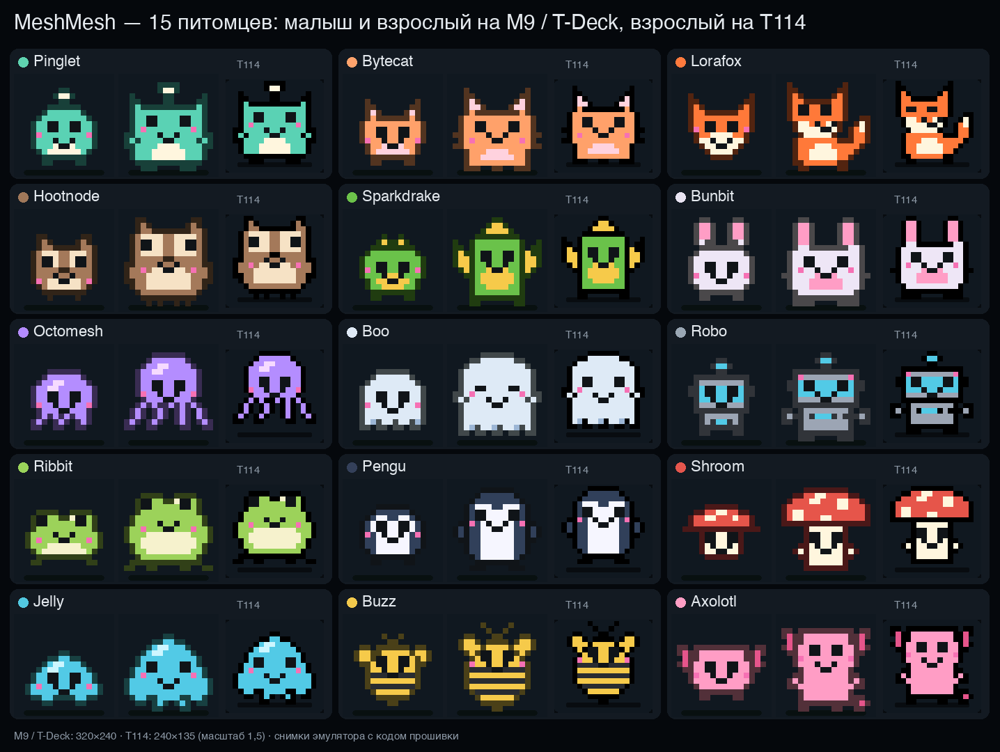

# Питомец сети

Пиксельный зверёк вроде тамагочи, который живёт на устройстве и питается эфиром. Заводить его не
обязательно: на новой прошивке питомца нет, пока владелец не нажмёт «Завести питомца» (на экране, на
веб-странице или в приложении, USB `pet adopt`), и его можно отпустить («Отпустить…», `pet release`):
он уходит без надгробия, память о прежних питомцах остаётся. Питомец, заведённый раньше, сохраняется.
Живёт он в прошивке устройства; веб-страница и приложение показывают его и управляют им. Есть на всех платах:
на M9 и T-Deck это плитка «Питомец», на однокнопочных платах и GAT562 — отдельный экран после «Шахмат».
Heltec V4/V3, Wireless Tracker, T-Beam и другие платы с OLED 128×64 рисуют его контуром, как на
ЖК-экране брелока, а T114 — в цвете в родном разрешении 240×135. Питомец живёт и в режимах репитера
и комнаты: там его кормит пересылаемый трафик.

## Виды

Пятнадцать видов, у каждого свой рисунок, детский облик (малыш, детёныш) и взрослый (подросток, взрослый) и
свои цвета тела и акцента: Pinglet (с антенной), Bytecat (кот), Lorafox (лис с хвостом), Hootnode (сова),
Sparkdrake (дракончик), Bunbit (кролик), Octomesh (осьминог), Boo (призрак), Robo (робот), Ribbit (лягушка),
Pengu (пингвин), Shroom (гриб), Jelly (слизень), Buzz (пчела), Axolotl (аксолотль). Вид и имя нового яйца
выбираются случайно (аппаратный генератор), пятна на яйце — цвета будущего вида. Акцент в верхних рядах
(шарик антенны, уши кролика) вспыхивает при приёме пакета. На OLED вид узнаётся по контуру.



Рисунки — в `tools/pet_sprites.py` (16×16, по два бита на точку, около 2 КБ на все виды); он создаёт
`include/PetSprites.h`, а с `--sheet OUT.png` рисует все виды. Палитра T114 берёт цвета оттуда же.

Код: `src/Pet.cpp`, `include/Pet.h` (жизнь, еда, сохранение), `src/UiPet.inc` (экран
320×240), `src/UiPetCompact.inc` (OLED 128×64), страница в `src/UiHires.inc` (T114). Состояние хранится в
файле `/meshmesh/pet.bin` в LittleFS (около 450 байт, с контрольной суммой), а не в NVS.

## Чем он питается

| Событие | Что даёт |
|---|---|
| Принятый пакет LoRa | сытость +0,2 %, опыт +1; антенна на голове вспыхивает |
| Пакет, пересланный для других | сытость +0,2 %, радость +0,2 %, опыт +1 |
| Каждые 25 пакетов (принятых или пересланных) | вкусняшка (не больше 9) |
| Входящее сообщение (личное или в канале) | сытость +1,5 %, радость +4 %, опыт +5 |
| Доставленное сообщение (ACK) | вкусняшка, радость +4 %, опыт +10 |
| Новый узел, впервые услышанный за его жизнь | радость +15 %, опыт +30 («Новый друг: …») |
| Победа в шахматах (по рейтинговой книге) | радость +20 %, опыт +50 |
| Прогулка: IMU M9 чувствует, что устройство несут | радость +6 %, опыт +3 |
| Погладить (не чаще раза в 20 с) | радость +10 %, опыт +1 |
| Покормить вкусняшкой | сытость +30 % |
| Лечить (вкусняшка, не чаще раза в 5 мин, при здоровье ниже 80 %) | здоровье +30 % |
| Каждые 6 часов работы | крошка из эфира: вкусняшка |

Время идёт, только пока устройство включено: выключенный питомец спит и не голодает. Сытость падает
на 4 % в час, радость на 3 % в час (в режимах сервера на 1,2 % в час: с ним некому играть). Ночью по
местным часам (23:00–7:00, если часы установлены) он спит, сытость падает на 1,5 % в час, а радость
не падает.

## Рост

Яйцо вылупляется через 15 минут работы. Дальше стадия идёт по уровню, но не быстрее возраста:

| Стадия | Уровень | Возраст не меньше |
|---|---|---|
| Малыш | 1–2 | — |
| Детёныш | 3–5 | 2 ч |
| Подросток | 6–9 | 1 сутки |
| Взрослый | 10+ | 3 суток |

Уровень n начинается с опыта 25·n·(n−1): 2-й с 50, 3-й со 150, 10-й с 2250. Имя можно сменить.

## Смерть

Здоровье растёт на 2,5 % в час, пока сытость и радость выше 30 %. Если сытость или радость упали до
нуля, здоровье теряет по 1,5 % в час за каждую из них. Тишина в эфире без всякого ухода убивает
его примерно за 2,5 суток включённой работы (сутки до пустой миски, потом голод и скука вместе), а
один только голод при хорошем настроении — почти за 4 суток.

При нулевом здоровье питомец умирает «от голода» (если сытость на нуле) или «от одиночества». На его
месте остаётся надгробие с именем, возрастом и причиной; три последних питомца хранятся в памяти.
OK (удержание на OLED) начинает новое яйцо следующего поколения.

Смерть можно выключить: «Смерть: выкл.» (клавиша D на M9, пункт меню на OLED, `pet mortal off`).
Тогда здоровье не опускается ниже 1 %: питомец болеет, грустит, но не умирает.

В режимах репитера и комнаты хозяина рядом нет, поэтому голодный питомец сам съедает вкусняшку.

## Экран

**M9 и T-Deck.** Плитка «Питомец» на главном экране (жёлтая, если ему нужен уход); в режимах репитера
и комнаты экран открывает клавиша P. Слева зверёк на карточке с «облачком» реплик, справа имя,
стадия, уровень, опыт и полосы «Сытость», «Радость», «Здоровье». Клавиши: OK — погладить (касание
карточки на T-Deck; без питомца — завести), F — покормить, H — лечить, N — имя, D — смерть вкл/выкл,
R дважды — отпустить. На экране блокировки, когда нет
партии и непрочитанных сообщений, под часами виден маленький питомец.

**OLED 128×64 (Heltec и другие однокнопочные платы).** Экран после «Шахмат»: зверёк слева, справа
настроение и три полосы с значками (миска, сердце, крест). Удержание кнопки открывает меню: «Погладить»,
«Кормить», «Лечить», «Смерть: вкл./выкл.»; у надгробия — «Новое яйцо». На GAT562 то же открывает
центр джойстика.

**Веб-страница и приложение для Android.** Плитка «Питомец» на главной и раздел с тем же зверьком в цветах
его вида (страница рисует рисунок, который присылает прошивка: `/api/pet`, в приложении — команда `pet`
по USB или BLE), репликой, полосами, опытом, вкусняшками, друзьями и возрастом; кнопки «Погладить»,
«Покормить», «Лечить», «Имя», «Смерть вкл./выкл.», «Отпустить…» (подтверждается вторым нажатием),
у надгробия — «Новое яйцо», без питомца — «Завести питомца»; внизу — память. Страница обновляет его раз
в 1,2 с (в приложении — раз в 2 с).

**T114.** Тот же экран и меню, но в цвете: карточка со зверьком, «облачко» с репликой, полосы с иконками.

Реплики: «Новый друг: …», «Сообщение! Вкусно», «Голодно: эфир пуст», «Напиши кому-нибудь?»; во время
реплики он шевелит ртом. Настроения: счастлив, спокоен, голоден, скучает, спит, болеет, ест.

## USB

```
pet                       состояние в JSON (сытость, радость, здоровье 0–1000, уровень, опыт, счётчики, могилы)
pet cuddle|feed|heal      погладить, покормить, полечить
pet adopt                 завести питомца (или новое яйцо после смерти; также pet egg)
pet release               отпустить питомца (без надгробия)
pet mortal on|off         смерть вкл/выкл
pet name ИМЯ              имя, 1–15 байт UTF-8
pet skip СЕКУНДЫ          прокрутить его время вперёд (до 14 суток) — для проверки роста и смерти
```

## Что не сделано

- Встречи и обмен между питомцами разных устройств (BLE-«бум», визиты по LoRa, подписанный альбом
  встреч) и ответы репитера на `!pet` из сети — следующий этап.
- NFC на платах нет; вместо касания меткой предполагаются BLE и LoRa.
- Платы без экрана (XIAO, T-Beam без OLED) показывают питомца только на веб-странице, в приложении и по USB.

## Проверка

В эмуляторе экранов (`tools/ui_preview/build.sh m9|heltec|gat562|t114`) сценарий открывает страницу
питомца, снимает яйцо, счастливого, голодного, больного и надгробие и проверяет: смерть при нулевом
здоровье, новое яйцо с записью в памяти, вылупление через 15 минут, отсутствие смерти при выключенной
смерти. Проверки на платах записываются в [verification.md](verification.md).
